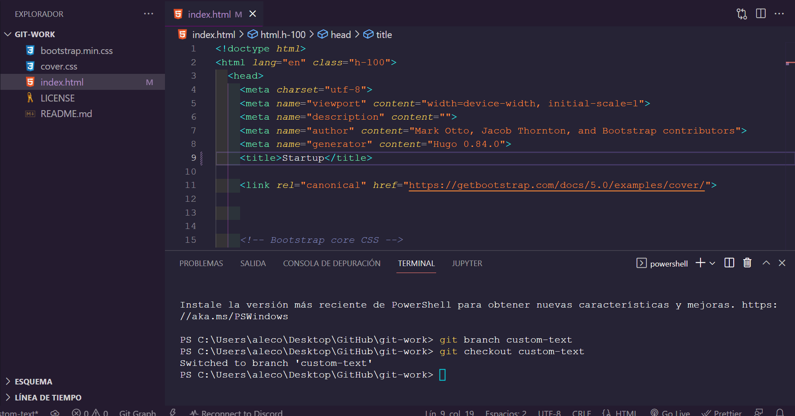
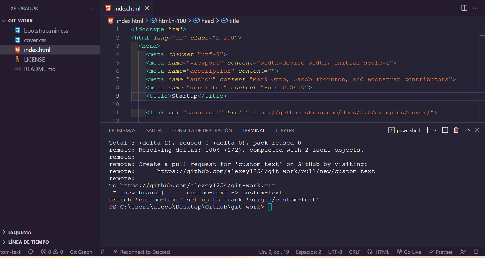
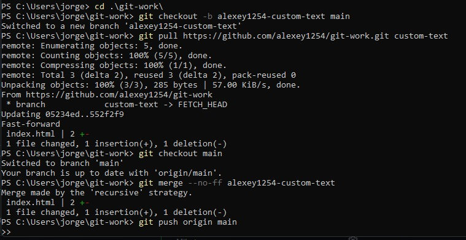
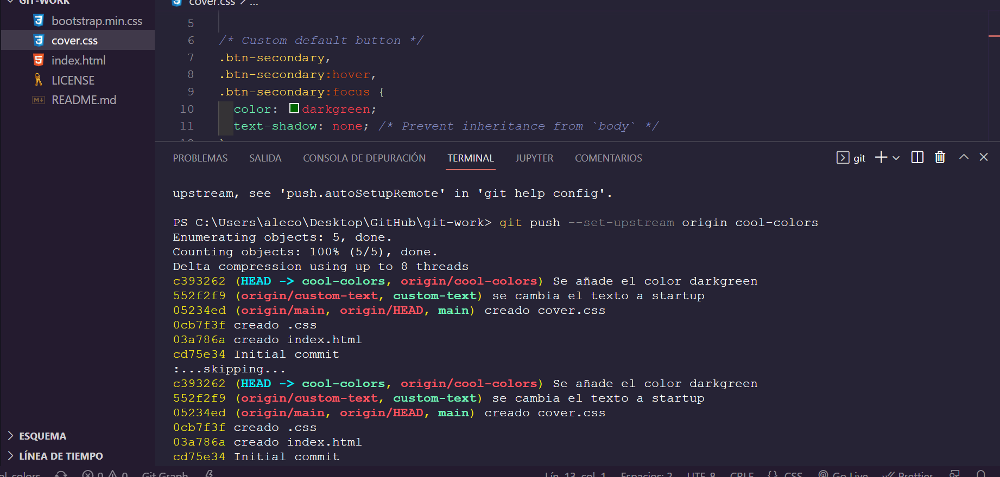
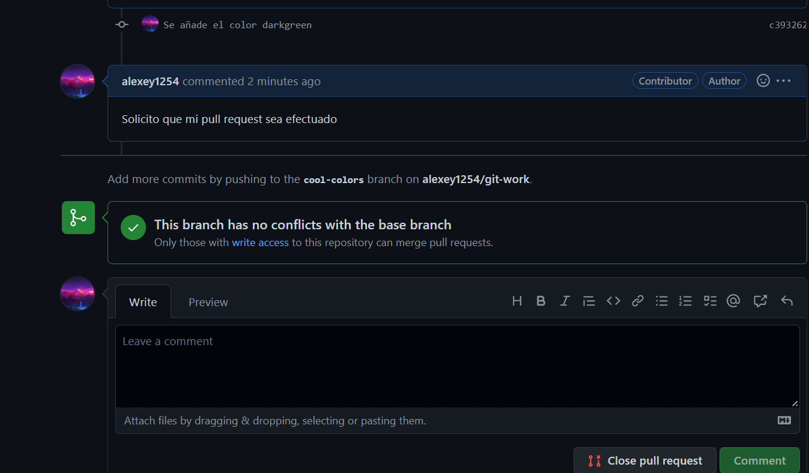
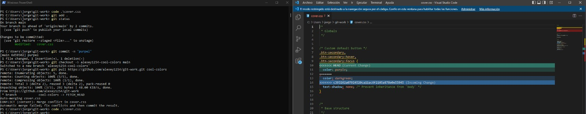

# Trabajando con git

`alu 1` Ha creado el repositorio y le ha puesto la licencia del MIT


`alu 2` Ha hecho un fork del repositorio de `alu 1`, ha clonado el fork desde su cuenta de GitHub. Después de eso, ha creado una nueva rama llamada `custom-text` y ha modificado una linea del fichero index.html



Después de eso, `alu 2` ha hecho un `pull request` a `alu 1`



`alu 1` ha revisado el pull request en su maquina y ha dado el visto bueno, así que lo acepta.



`alu 2` incluye los cambios en la rama principal, situandose en esta con:

```bash
$git checkout main
$git merge custom-text
```

Ahora, `alu 1` cambia la linea 10 de `cover.css` a:

```css
color: purple;
```

Entonces, mientras tanto, `alu 2` crea una nueva rama llamada `cool-colors`, ahí modifica la misma linea que `alu 1`, pero con otro color:

```css
color: darkgreen;
```



`alu 2` envía un pull request a `alu 1`



`alu 1` prueba el pull request de `alu 2` y quiere hacer un merge. Pero surge un conflicto. Este conflicto se soluciona cambiando la linea donde está el problema. Aceptando o denegando los `incoming changes`. Una vez hecho esto, se puede hacer el `merge`


