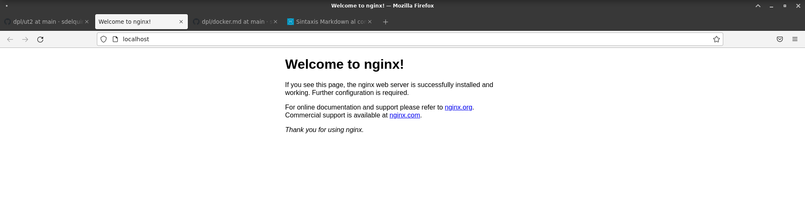
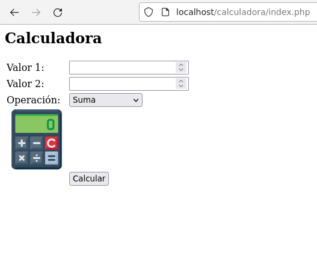
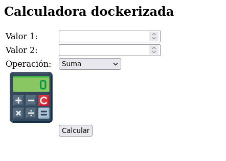

# Implantación de arquitecturas web

## Nativo

- Antes de empezar, lo ideal es hacer un `sudo apt update && sudo apt upgrade -y`
  
~~~shell
alejandro@marte10:~/Escritorio/calculadoraDocker$ sudo apt update && sudo apt upgrade -y
Obj:1 http://security.debian.org/debian-security bullseye-security InRelease
Obj:2 http://deb.debian.org/debian bullseye InRelease                                                              
Obj:3 http://deb.debian.org/debian bullseye-updates InRelease                                                      
Obj:4 http://nginx.org/packages/debian bullseye InRelease                                                          
Obj:5 https://download.docker.com/linux/debian bullseye InRelease                                                  
Obj:6 http://packages.microsoft.com/repos/code stable InRelease                                                    
Obj:7 https://packages.microsoft.com/repos/vscode stable InRelease                                                
Obj:8 https://packages.sury.org/php bullseye InRelease                                                 
Leyendo lista de paquetes... Hecho
Creando árbol de dependencias... Hecho
Leyendo la información de estado... Hecho
Todos los paquetes están actualizados.
Leyendo lista de paquetes... Hecho
Creando árbol de dependencias... Hecho
Leyendo la información de estado... Hecho
Calculando la actualización... Hecho
0 actualizados, 0 nuevos se instalarán, 0 para eliminar y 0 no actualizados.

~~~

- De esta forma, hacemos que nuestro equipo se actualice y actualice sus repositorios

- Después, tenemos que instalar unos paquetes de soporte con el siguiente comando:

~~~shell
sudo apt install -y curl gnupg2 ca-certificates lsb-release debian-archive-keyring
~~~

- Desarmamos y guardamos la clave de firma de Nginx:

~~~shell
curl -fsSL https://nginx.org/keys/nginx_signing.key \
| sudo gpg --dearmor -o /etc/apt/trusted.gpg.d/nginx.gpg
~~~

- Añadimos las fuentes del repositorio oficial de Nginx

~~~shell
echo 'deb http://nginx.org/packages/debian bullseye nginx' \
| sudo tee /etc/apt/sources.list.d/nginx.list > /dev/null
~~~

- Actualizamos los paquetes con `sudo apt update`, al hacer esto, podemos instalar Nginx en nuestra máquina.

~~~shell
sudo apt install nginx -y
~~~

- Con este comando instalamos Nginx, el argumento de -y es para decirle que si a que lo instale sin preguntar por espacio de almacenamiento.
- En principio, nuestro servidor debería estar instalado en nuestro sistema. Podemos comprobarlo haciendo lo siguiente:

~~~shell
alejandro@marte10:~$ sudo systemctl status nginx
● nginx.service - nginx - high performance web server
     Loaded: loaded (/lib/systemd/system/nginx.service; enabled; vendor preset: enabled)
     Active: inactive (dead) since Mon 2022-10-24 19:23:07 WEST; 1s ago
       Docs: https://nginx.org/en/docs/
    Process: 7244 ExecStart=/usr/sbin/nginx -c /etc/nginx/nginx.conf (code=exited, status=0/SUCCESS)
    Process: 11382 ExecStop=/bin/sh -c /bin/kill -s TERM $(/bin/cat /var/run/nginx.pid) (code=exited, status=0/SUCC>
   Main PID: 7245 (code=exited, status=0/SUCCESS)
        CPU: 33ms

oct 24 18:59:58 marte10 systemd[1]: Starting nginx - high performance web server...
oct 24 18:59:58 marte10 systemd[1]: Started nginx - high performance web server.
oct 24 19:23:07 marte10 systemd[1]: Stopping nginx - high performance web server...
oct 24 19:23:07 marte10 systemd[1]: nginx.service: Succeeded.
oct 24 19:23:07 marte10 systemd[1]: Stopped nginx - high performance web server.
~~~

- Vemos que ya está instalado en el sistema, pero está inactivo. Para levantarlo, usamos `sudo systemctl start nginx`, una vez hecho esto, podemos ver que el servicio se levanta.

- Para ver nuestro servidor corriendo, vamos a firefox o a nuestro navegador predeterminado y escribimos localhost. Tiene que verse lo siguiente:
  

- Para ello, necesitamos instalar unos requisitos previos para que Nginx pueda leer PHP.

~~~shell
sudo apt update && sudo apt install -y lsb-release ca-certificates \
apt-transport-https software-properties-common gnupg2
~~~

- Añadimos un repositorio externo para descargarnos PHP-FPM

~~~shell
echo "deb https://packages.sury.org/php/ $(lsb_release -sc) main" \
| sudo tee /etc/apt/sources.list.d/sury-php.list
~~~

- Importamos la clave [GPG](https://es.wikipedia.org/wiki/GNU_Privacy_Guard) del repositorio:

~~~shell
curl -fsSL  https://packages.sury.org/php/apt.gpg \
| sudo gpg --dearmor -o /etc/apt/trusted.gpg.d/sury.gpg
~~~

- Actualizamos nuestra lista de repositorios con `sudo apt update` y vemos que paquetes de php podemos instalar:

~~~shell
alejandro@marte10:~$ apt-cache search --names-only 'php*-fpm'
php7.4-fpm - server-side, HTML-embedded scripting language (FPM-CGI binary)
php-fpm - server-side, HTML-embedded scripting language (FPM-CGI binary) (default)
php5.6-fpm - server-side, HTML-embedded scripting language (FPM-CGI binary)
php7.0-fpm - server-side, HTML-embedded scripting language (FPM-CGI binary)
php7.1-fpm - server-side, HTML-embedded scripting language (FPM-CGI binary)
php7.2-fpm - server-side, HTML-embedded scripting language (FPM-CGI binary)
php7.3-fpm - server-side, HTML-embedded scripting language (FPM-CGI binary)
php8.0-fpm - server-side, HTML-embedded scripting language (FPM-CGI binary)
php8.1-fpm - server-side, HTML-embedded scripting language (FPM-CGI binary)
php8.2-fpm - server-side, HTML-embedded scripting language (FPM-CGI binary)
~~~

- En mi caso, instalaré la *v8.2* con `sudo apt install -y php8.2-fpm`. Como éste se instala en el sistema como un servicio, podemos comprobar su estado con `systemctl`

~~~shell
alejandro@marte10:~$ sudo systemctl status php8.2-fpm
[sudo] password for alejandro: 
● php8.2-fpm.service - The PHP 8.2 FastCGI Process Manager
     Loaded: loaded (/lib/systemd/system/php8.2-fpm.service; enabled; vendor preset: enabled)
     Active: active (running) since Mon 2022-10-24 18:31:45 WEST; 1h 7min ago
       Docs: man:php-fpm8.2(8)
   Main PID: 638 (php-fpm8.2)
     Status: "Processes active: 0, idle: 2, Requests: 1, slow: 0, Traffic: 0req/sec"
      Tasks: 3 (limit: 7122)
     Memory: 18.3M
        CPU: 425ms
     CGroup: /system.slice/php8.2-fpm.service
             ├─638 php-fpm: master process (/etc/php/8.2/fpm/php-fpm.conf)
             ├─780 php-fpm: pool www
             └─781 php-fpm: pool www

oct 24 18:31:42 marte10 systemd[1]: Starting The PHP 8.2 FastCGI Process Manager...
oct 24 18:31:45 marte10 systemd[1]: Started The PHP 8.2 FastCGI Process Manager.
~~~

### Hemos terminado la instalación de php-fpm. Ahora queda implementarlo a Nginx. Vamos a editar el fichero de configuracion de php para permitir que el usuario nginx pueda acceder al [socket unix](https://es.wikipedia.org/wiki/Socket_Unix)

~~~shell
sudo gedit /etc/php/8.2/fpm/pool.d/www.conf
~~~

- Editamos estas lineas:

~~~shell
23| user = nginx
24| group = nginx
...
51| listen.owner = nginx
52| listen.group = nginx
~~~

- Guardamos y recargamos la configuración con `sudo systemctl reload php8.2-fpm`

Ahora vamos a habilitar la *comunicacion entre php y Nginx*

~~~shell
sudo gedit /etc/nginx/conf.d/default.conf
~~~

Buscamos el bloque que contenga `location ~ \.php$`

~~~shell
location ~ \.php$ {
    root           /usr/share/nginx/html;
    fastcgi_pass   unix:/var/run/php/php8.2-fpm.sock;
    index          index.php;
    include        fastcgi_params;
    fastcgi_param  SCRIPT_FILENAME   $document_root$fastcgi_script_name;
}
~~~

- Para finalizar, verificamos la sintaxis del fichero con `sudo nginx -t`

~~~shell
alejandro@marte10:~$ sudo nginx -t
nginx: the configuration file /etc/nginx/nginx.conf syntax is ok
nginx: configuration file /etc/nginx/nginx.conf test is successful
~~~

### Hasta aquí hemos terminado la instalación de Nginx. Vamos a implementar una página con php de una calculadora en la máquina virtual

- Lo primero, sería crear un enlace simbolico desde la ruta que nginx usa para leer los archivos, hasta la raíz de nuestro proyecto.

~~~shell
sudo ln -s <path/to/directory> /usr/share/nginx/html/
~~~

- En la raíz de mi proyecto, tengo tres archivos, los cuales serían:
  - index.php
  - style.css
  - calculadora.png

- En el navegador, ponemos `localhost/calculadora/index.php`

[Aquí](src/index.php) puedes ver el código fuente.

## Dockerizado

Ahora pasamos a hacerlo con Nginx dentro de docker. Para ello, *pausamos el servicio de Nginx* en nuestra máquina fisica para que no haya ningún conflicto con el Nginx de docker.

En este caso, vamos a tener unos archivos de configuración de docker, pero antes de meternos en ello, veamos cómo he instalado docker.

- Para instalarlo, hacemos lo siguiente:

~~~shell
$ sudo apt update 
  ...
$ sudo apt install -y \
    ca-certificates \
    curl \
    gnupg \
    lsb-release
~~~

- Importamos la clave GPG del repositorio externo de docker con

~~~shell
curl -fsSL https://download.docker.com/linux/debian/gpg | sudo gpg --dearmor -o /etc/apt/trusted.gpg.d/docker.gpg
~~~

- Añadimos el repositorio de docker:

~~~shell
echo \
  "deb [arch=$(dpkg --print-architecture)] https://download.docker.com/linux/debian \
  $(lsb_release -cs) stable" | sudo tee /etc/apt/sources.list.d/docker.list > /dev/null
~~~

- Hacemos `sudo apt update` para que nos actualice los repositorios y finalmente instalamos docker con algunos plugins.

~~~shell
sudo apt install -y docker-ce docker-ce-cli containerd.io docker-compose-plugin
~~~

Verificamos que docker está en marcha con `sudo systemctl status docker`

~~~shell
● docker.service - Docker Application Container Engine
     Loaded: loaded (/lib/systemd/system/docker.service; enabled; vendor preset: enabled)
     Active: active (running) since Tue 2022-10-25 10:41:56 WEST; 16min ago
TriggeredBy: ● docker.socket
       Docs: https://docs.docker.com
   Main PID: 879 (dockerd)
      Tasks: 10
     Memory: 108.7M
        CPU: 515ms
     CGroup: /system.slice/docker.service
             └─879 /usr/bin/dockerd -H fd:// --containerd=/run/containerd/containerd.sock

oct 25 10:41:54 marte10 dockerd[879]: time="2022-10-25T10:41:54.254404691+01:00" level=info msg="ccResolverW>
oct 25 10:41:54 marte10 dockerd[879]: time="2022-10-25T10:41:54.254415206+01:00" level=info msg="ClientConn >
oct 25 10:41:54 marte10 dockerd[879]: time="2022-10-25T10:41:54.731512377+01:00" level=info msg="[graphdrive>
oct 25 10:41:54 marte10 dockerd[879]: time="2022-10-25T10:41:54.804595674+01:00" level=info msg="Loading con>
oct 25 10:41:55 marte10 dockerd[879]: time="2022-10-25T10:41:55.266142461+01:00" level=info msg="Default bri>
oct 25 10:41:55 marte10 dockerd[879]: time="2022-10-25T10:41:55.322129803+01:00" level=info msg="Loading con>
oct 25 10:41:56 marte10 dockerd[879]: time="2022-10-25T10:41:56.007627368+01:00" level=info msg="Docker daem>
oct 25 10:41:56 marte10 dockerd[879]: time="2022-10-25T10:41:56.010943278+01:00" level=info msg="Daemon has >
oct 25 10:41:56 marte10 dockerd[879]: time="2022-10-25T10:41:56.092889375+01:00" level=info msg="API listen >
oct 25 10:41:56 marte10 systemd[1]: Started Docker Application Container Engine.
~~~

- Como podemos ver, esta active (running).

Después, quedaría un pequeño detalle, el cual sería para que nuestro usuario tenga privilegios para ejecutar docker con el siguiente comando.

~~~shell
sudo usermod -aG docker $USER
~~~

Para que nuestros cambios funcionen, debemos cerrar la sesión.

### Eso sería todo en cuanto a la instalación de docker. Vamos a ver como podemos iniciar nuestra página web de calculadora dentro de docker

### Para hacer esto, vamos a la carpeta donde queramos que sea la raíz de nuestro proyecto y creamos lo siguiente

~~~shell
alejandro@marte10:~/Escritorio/calculadoraDocker$ tree
.
├── default.conf
├── docker-compose.yml
└── src
    ├── calculadora.png
    ├── index.php
    └── style.css
~~~

Crearemos una carpeta llamada `src` donde irá nuestro código fuente, un archivo `default.conf` y otro llamado `docker-compose.yml`

- Dentro de `default.conf` irá lo siguiente:

~~~conf
server {
  server_name _;
  index index.php index.html;

  location ~ \.php$ {
    fastcgi_pass php-fpm:9000;
    include fastcgi_params;  # fichero incluido en la instalación
    fastcgi_param SCRIPT_FILENAME $document_root$fastcgi_script_name;
  }
}
~~~

- Dentro de `docker-compose.yml`:

~~~yml
version: "3.3"

services:
  web:
    image: nginx
    volumes:
      - ./src:/etc/nginx/html # "root" por defecto en Nginx
      - ./default.conf:/etc/nginx/conf.d/default.conf
    ports:
      - 80:80

  php-fpm:
    image: php:8-fpm
    volumes:
      - ./src:/etc/nginx/html
~~~

- Teniendo todo esto y la página dentro de la carpeta src, sólo quedaría iniciar nuestro contenedor con el siguiente comando:

~~~docker
alejandro@marte10:~/Escritorio/calculadoraDocker$ docker compose up
[+] Running 2/0
 ⠿ Container calculadoradocker-php-fpm-1  Created                          0.0s
 ⠿ Container calculadoradocker-web-1      Created                          0.0s
Attaching to calculadoradocker-php-fpm-1, calculadoradocker-web-1
calculadoradocker-php-fpm-1  | [25-Oct-2022 10:12:01] NOTICE: fpm is running, pid 1
calculadoradocker-php-fpm-1  | [25-Oct-2022 10:12:01] NOTICE: ready to handle connections
calculadoradocker-web-1      | /docker-entrypoint.sh: /docker-entrypoint.d/ is not empty, will attempt to perform configuration
calculadoradocker-web-1      | /docker-entrypoint.sh: Looking for shell scripts in /docker-entrypoint.d/
calculadoradocker-web-1      | /docker-entrypoint.sh: Launching /docker-entrypoint.d/10-listen-on-ipv6-by-default.sh
calculadoradocker-web-1      | 10-listen-on-ipv6-by-default.sh: info: Getting the checksum of /etc/nginx/conf.d/default.conf
calculadoradocker-web-1      | 10-listen-on-ipv6-by-default.sh: info: /etc/nginx/conf.d/default.conf differs from the packaged version
calculadoradocker-web-1      | /docker-entrypoint.sh: Launching /docker-entrypoint.d/20-envsubst-on-templates.sh
calculadoradocker-web-1      | /docker-entrypoint.sh: Launching /docker-entrypoint.d/30-tune-worker-processes.sh
calculadoradocker-web-1      | /docker-entrypoint.sh: Configuration complete; ready for start up
calculadoradocker-web-1      | 2022/10/25 10:12:01 [notice] 1#1: using the "epoll" event method
calculadoradocker-web-1      | 2022/10/25 10:12:01 [notice] 1#1: nginx/1.23.2
calculadoradocker-web-1      | 2022/10/25 10:12:01 [notice] 1#1: built by gcc 10.2.1 20210110 (Debian 10.2.1-6) 
calculadoradocker-web-1      | 2022/10/25 10:12:01 [notice] 1#1: OS: Linux 5.10.0-19-amd64
calculadoradocker-web-1      | 2022/10/25 10:12:01 [notice] 1#1: getrlimit(RLIMIT_NOFILE): 1048576:1048576
calculadoradocker-web-1      | 2022/10/25 10:12:01 [notice] 1#1: start worker processes
calculadoradocker-web-1      | 2022/10/25 10:12:01 [notice] 1#1: start worker process 28
calculadoradocker-web-1      | 2022/10/25 10:12:01 [notice] 1#1: start worker process 29
calculadoradocker-web-1      | 2022/10/25 10:12:01 [notice] 1#1: start worker process 30
calculadoradocker-web-1      | 2022/10/25 10:12:01 [notice] 1#1: start worker process 31
~~~

- Para finalizar, vamos a nuestro navegador y escribimos `localhost`

[Aquí](src/index.php) estaría el código fuente que es el mismo que el de la máquina local
