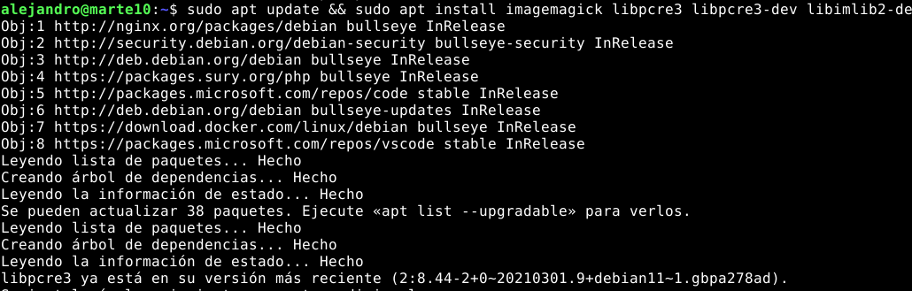
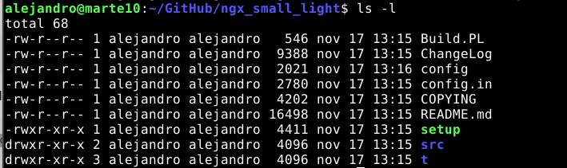
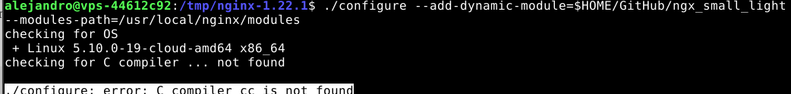
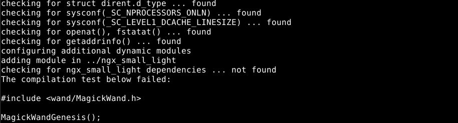
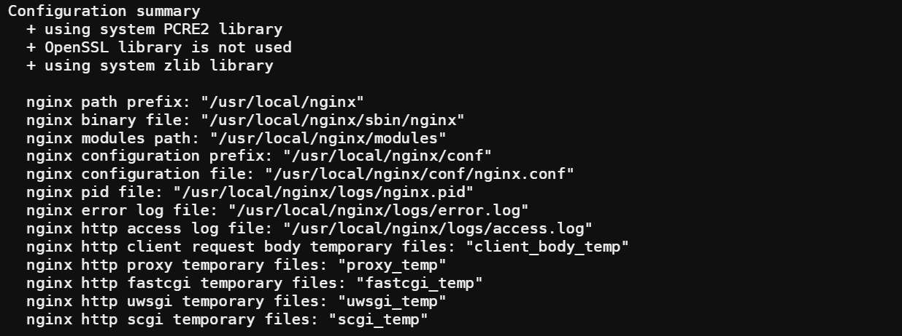

# ngx_small_light

### aqui va el indice

## Antes de hacer nada, voy a mirar la documentación del modulo que voy a instalar

### Dependencias

    Puedo ver que hay dos apartados que para mi, en la tabla de contenidos me llaman la atención.


    Asi que voy primero a ver las dependencias. Veo que hay dos que son requeridas y dos opcionales. Voy a instalar las 4.

- PCRE (required)
- ImageMagick (required)
- Imlib2 (optional)
- GD (optional)

` $ sudo apt update && sudo apt install imagemagick libpcre3 libpcre3-dev libimlib2-dev -y `



### Instalación

Antes que nada, me gustaría añadir que para que todo esto funcione, necesitamos instalar las build-essential con `sudo apt install -y build-essential`

Voy a instalar el modulo *ngx_small_light* dinámicamente, para ello tengo que descargar el nginx en la versión actual que tengo instalada en el sistema. Para ello puedo usar el siguiente comando:

` curl -sL https://nginx.org/download/nginx-$(/sbin/nginx -v \
|& cut -d '/' -f2).tar.gz | tar xvz -C /tmp `

Este comando, descarga la versión de nginx que tengo instalada en el sistema en la carpeta temporal */tmp*

Despues de esto, descargo el codigo fuente del módulo, en mi caso lo descargaré dentro de una carpeta dedicada para *GitHub*. Para ello hago:

` git clone https://github.com/cubicdaiya/ngx_small_light.git /tmp/ngx_small_light`



Ahora voy a la carpeta donde se descargó el Nginx y escribo lo siguiente

`./configure --add-dynamic-module=../ngx_small_light`

Pero me salta un error



Dice que no encuentra el compilador de c, vamos a instalarlo con `sudo apt install gcc`

Después de haber hecho eso, me sale este error:



Esto es debido a que pensaba que había instalado bien magick, así que lo que hice fué ir a la pagina oficial de [magick](http://www.imagemagick.org/script/install-source.php), me descargué el codigo fuente desde su GitHub y seguí los pasos para instalar esta dependencia. Me situé en la carpeta de magick y escribí lo siguiente:

``` shell
    ./configure
    gmake
    sudo gmake install
    sudo ldconfig /usr/local/lib
```

Finalmente un `make check` para ver que todo funciona bien y corra sus tests.

Ahora, cruzo los dedos para que se me haga bien el `./configure` 🤞

No funcionó, estuve tiempo mirando, hasta que le pregunté al profesor. Lo solucionamos juntos. Me fuí a la carpeta de ImageMagick *descargada de github*, desinstalé este programa. También lo desinstalé desde el apt con los siguientes comandos:

```
    sudo make uninstall
    sudo apt remove --purge -y imagemagick  libmagickwand-dev
    sudo apt-get autoremove
```

Finalmente volví a instalar las dependencias.

```
sudo apt install -y imagemagick libpcre3 libpcre3-dev libmagickwand-dev
```

Después fuí a la carpeta del codigo fuente de *ngx_small_light* e hice un `./setup` para que vuelva a cargar todo y se pueda compilar cuando vaya a importarlo a Nginx. Finalmente fuí a la carpeta donde tenía descargado Nginx y lo compilé con los siguientes comandos:

```
./configure --add-dynamic-module=../ngx_small_light
make modules
sudo cp objs/ngx_http_small_light_module.so /etc/nginx/modules
```



Ahora, vamos a usar este modulo en el fichero de configuración de Nginx. `sudo vi /etc/nginx/nginx.conf`


