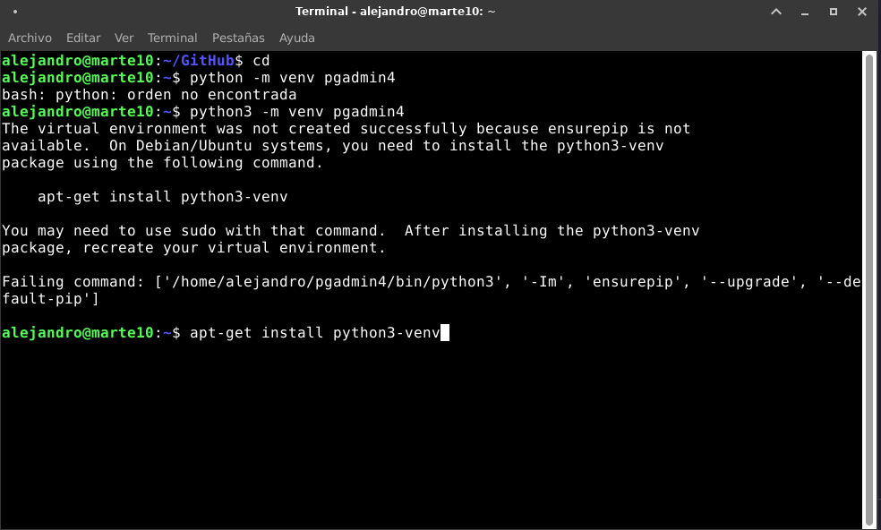

# UT4-TE1: Administración de servidores web (PostgreSQL)

## **Indice:**

[Instalacion de postgre](#instalación-de-postgresql)

[Instalacion de pgAdmin](#instalación-de-pgadmin)
- [Demonizar pgAdmin](#hacemos-del-servicio-un-demonio)

[Resultado en arkania](#resultado-en-entorno-virtual)

[Recursos y enlaces](#direcciones)

------------------

## **Instalación de PostgreSQL**

Antes de instalar, recordar que siempre debemos de hacer un `sudo apt update`. Después de eso, instalamos los paquetes de soporte.

```bash
sudo apt install -y apt-transport-https
Leyendo lista de paquetes... Hecho
Creando árbol de dependencias... Hecho
Leyendo la información de estado... Hecho
apt-transport-https ya está en su versión más reciente (2.2.4).
0 actualizados, 0 nuevos se instalarán, 0 para eliminar y 38 no actualizados.
```

Descargamos la clave de firma de postgreSQL

```shell
curl -fsSL https://www.postgresql.org/media/keys/ACCC4CF8.asc \
| sudo gpg --dearmor -o /etc/apt/trusted.gpg.d/postgresql.gpg
```

Añadimos el repositorio oficial de PostgreSQL a la máquina:

```shell
echo "deb http://apt.postgresql.org/pub/repos/apt/ $(lsb_release -cs)-pgdg main" \
| sudo tee /etc/apt/sources.list.d/postgresql.list > /dev/null
```

Volvemos a hacer un `sudo apt update` para ver que ya tenemos el repositorio de PostgreSQL.

Con este comando, podemos ver las versiones que hay disponibles para instalar de postgre.

```shell
apt-cache search --names-only 'postgresql-[0-9]+$' | sort
postgresql-10 - The World's Most Advanced Open Source Relational Database
postgresql-11 - The World's Most Advanced Open Source Relational Database
postgresql-12 - The World's Most Advanced Open Source Relational Database
postgresql-13 - The World's Most Advanced Open Source Relational Database
postgresql-14 - The World's Most Advanced Open Source Relational Database
postgresql-15 - The World's Most Advanced Open Source Relational Database
```

En mi caso, instalo la ultima versión con `sudo apt install -y postgresql-15`


❗ **Postgre se abre en el puerto 5432**

## **Instalación de pgAdmin**

Como pgAdmin está hecho en python tendremos que tener instalado python en el sistema

Para instalarlo, necesitamos crear unas carpetas de trabajos y asignarle unos permisos. Para ello escribimos lo siguiente

```bash
sudo mkdir /var/lib/pgadmin
sudo mkdir /var/log/pgadmin
sudo chown $USER /var/lib/pgadmin
sudo chown $USER /var/log/pgadmin
```

Creamos un entorno virtual de Python e instalamos el paquete **pgadmin4**

```shell
cd
python -m venv pgadmin4
source pgadmin4/bin/activate

pip install pgadmin4
```

Como me dió un error, procedo a instalar el entorno virtual de python



Finalmente, hago los comandos y funcionan.


Para terminar, lanzamos el script de configuración con `pip install pgadmin4`


Con todo esto, tenemos un servidor de desarrollo. Hasta aquí en la máquina virtual.

- Para hacerlo en el servidor de producción, se hará lo hecho hasta aquí pero dentro del entorno virtual, escribimos lo siguiente `pip install gunicorn` y le ponemos un virtual host en Nginx

```yaml
server {
    server_name pgadmin.arkania.es;

    location / {
        proxy_pass http://unix:/tmp/pgadmin4.sock;
    }
}
```

## **Hacemos del servicio un demonio**

Para no tener que activarlo siempre, he demonizado el servicio. Para ello hay que seguir los siguientes pasos.

- Creamos un servicio dentro de systemd/system con el siguiente comando `sudo vi /etc/systemd/system/pgadmin.service`

y su contenido debe ser lo siguiente:

```
[Unit]
Description=pgAdmin

[Service]
User=alejandro
ExecStart=/bin/bash -c '\
source /home/alejandro/pgadmin4/bin/activate && \
gunicorn --chdir /home/alejandro/pgadmin4/lib/python3.9/site-packages/pgadmin4 \
--bind unix:/tmp/pgadmin4.sock \
pgAdmin4:app'
Restart=always

[Install]
WantedBy=multi-user.target
```

Despues recargo los servicios para luego levantar pgAdmin y habilitarlo si se reinicia el sistema.

```shell
sudo systemctl daemon-reload
sudo systemctl start pgadmin
sudo systemctl enable pgadmin
```

## **Resultado en entorno virtual**

- PgAdmin


- Travelroad


### **Direcciones:**

[Travelroad](http://php.travelroad.alu7396.arkania.es/)

[pgAdmin](http://pgadmin.alu7396.arkania.es)

[Source code](../pgapp/src/index.php)

[Config.php](../pgapp/src/config.php)

[Script de despliegue](../script.sh)